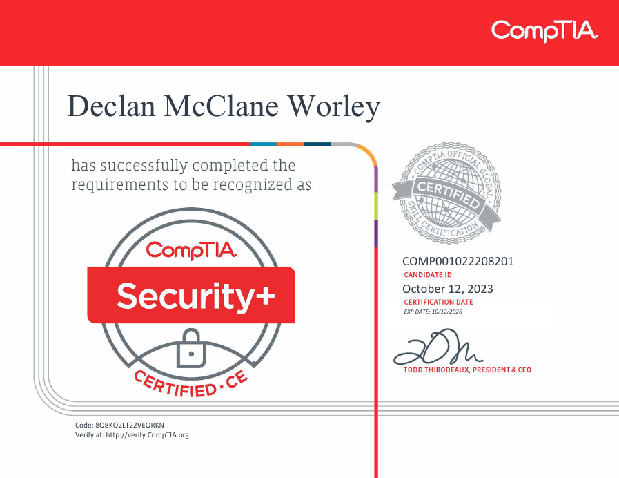
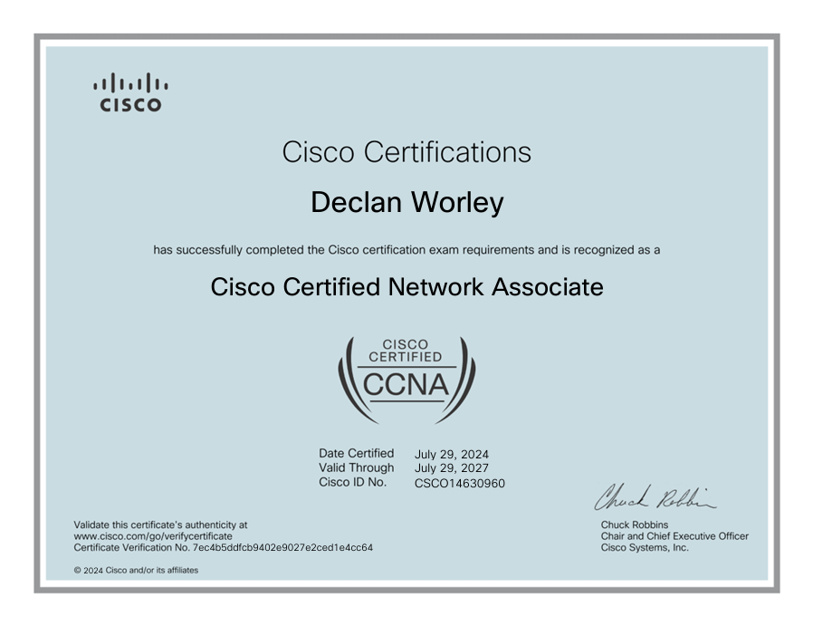

# README
 
# Declan Worley 

### LinkedIn
### GitHub

A highly motivated and talented graduate in Computer Science with a Cybersecurity Concentration. Skilled in utilizing various coding languages and software tools to analyze complex systems and identify vulnerabilities. Possesses experience in network administration, system security, database design, and socket programming, gained through relevant coursework and hands-on projects. Additionally, has demonstrated strong leadership skills by founding and leading a CyberPatriot team.

# Certifications:

## CompTIA Security+

## Cisco Certified Network Associate (CCNA)

